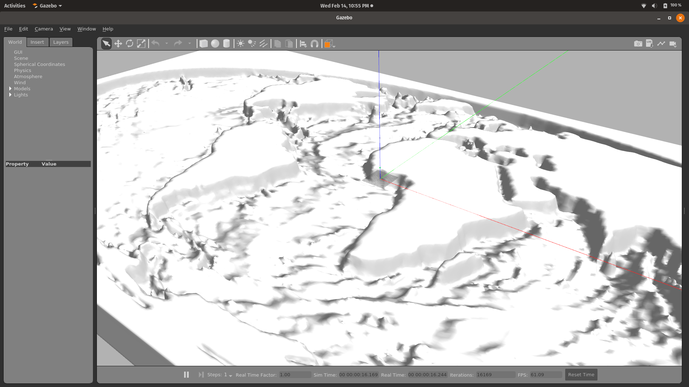
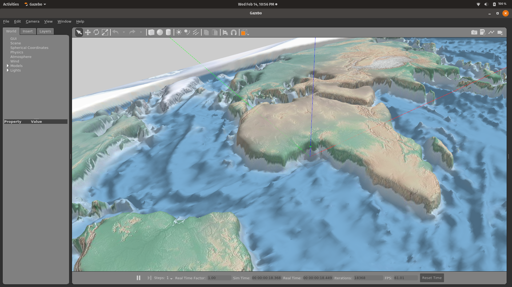

# simulation_worlds
 
This ROS package is a collection of Gazebo worlds for the simulation of the capstone ROV. The following worlds are available:

### Earth
A 800x400m map approximating the Earth's ocean floor, with depth at (0, 0) of ~10m. The height is approximated from [this map of Earth's gravity field](https://earthobservatory.nasa.gov/images/87189/seafloor-features-are-revealed-by-the-gravity-field) by NASA.
```
roslaunch simulation_worlds earth.launch
```


### Earth (colored)
Similar map as above with the texture of [Mollweide projection](https://commons.wikimedia.org/wiki/File:Mollweide.jpg) by Wikipedia.
```
roslaunch simulation_worlds earth_colored.launch
```
